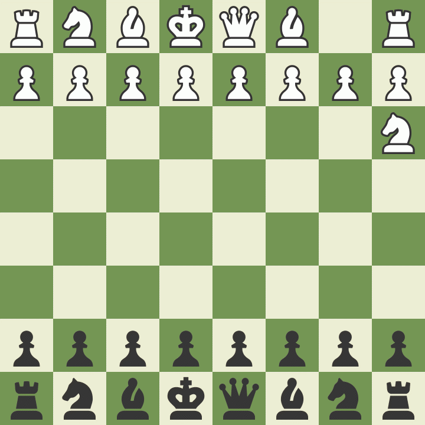

# MonkFish Chess Engine 🐟
*The Zen of Chess* 🧘‍♂️




## Description
MonkFish is a chess engine that maintains perfect balance, only capitalizing on its opponent's missteps. Like a Zen master, it doesn't force advantages but rather lets players create their own downfall. Built on Stockfish's powerful evaluation, MonkFish chooses moves that maintain equality, making it a mirror that reflects your own chess journey. Every loss against MonkFish is a lesson in self-inflicted defeat. ♟️

## Philosophy 🎯
- *"Every move a meditation"*
- *"Victory through self-defeat"*
- *"The stillness before the fall"*

## Technical Details ⚙️
A modified Stockfish engine that seeks positions with minimal advantage, playing the most equal continuation until the opponent creates winning chances through their own moves. Uses deep calculation and multiple principal variations to find the most balanced positions possible.
see [Technical Overview](/TECHNICAL_OVERVIEW.md)

## Reviews 💭
> "I was winning... I think I was winning... was I winning? No, I defeated myself."
> - Raghav, 1300 Rated Player

> "Played against it for 2 hours. Lost every game. Reviewed them all. It was just waiting... menacingly... before I blundered. Every. Single. Time."
> - Magnus Carlsend, Definitely Not The Real Magnus

> "The most passive-aggressive chess engine I've ever played."
> - Weak Stockfish, Chess Engine

> "Me: makes brilliant move
> MonkFish: I am one with the position
> Me: blunders queen
> MonkFish: The student becomes the teacher"
> - Martin, Chess.com

## Installation 🛠️
1. Prerequisites:
    - Python 3.x
    - A UCI-compatible chess GUI (Cute Chess is included)
    - Qt installed if using Cute Chess

2. Files in MonkFish:
    - monkfish.py - Core engine logic
    - uci.py - UCI interface
    - MonkFish.sh - Shell script for GUI integration
    - cutechess - gui to test games
    - stockfish - Download the binary from [Official Stockfish Repository](https://github.com/official-stockfish/Stockfish/releases) 
    - README.md - Documentation

3. Setup:
    ```bash
    # Ensure stockfish is executable
    chmod +x stockfish
    
    # Ensure shell script is executable
    chmod +x MonkFish.sh
    ```

## Usage 🎮
### With Cute Chess:
1. Open Cute Chess
2. Go to Engines → Configure Engines → Add
3. Configure engine:
    - Name: MonkFish
    - Command: /full/path/to/MonkFish.sh
    - Working Directory: /full/path/to/MonkFish/folder
    - Protocol: UCI
4. Click OK to save
5. Start a new game with MonkFish as your opponent

## Credits 🙏
Built on Stockfish, modified to achieve enlightenment through equality.

*Note: Your defeat was within you all along.* 🪞
